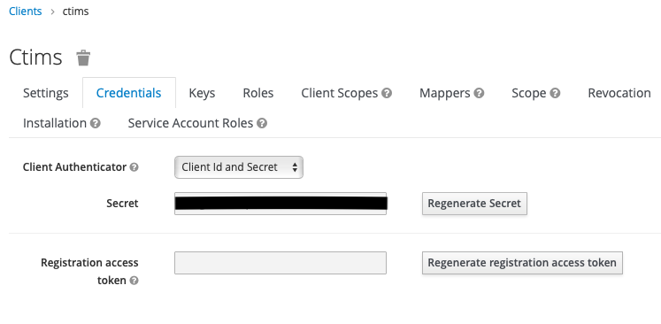

# Keycloak authentication setup

## Keycloak authentication setup

CTIMS can use a local desktop Keycloak instance or an institutional Keycloak instance.\
Configure the keycloak as shown in the below images. 

### Setting up Keycloak Realm

Keycloak comes with a default realm.

It is ideal to create a new realm named after \<username> or \<institution> name.

 

<figure><figcaption></figcaption></figure>

<figure><figcaption></figcaption></figure>

\
\
 

<figure><figcaption></figcaption></figure>

### Setting up Keycloak Client  called "ctims"

 

Setup a new client called ctims in keycloak. This is the client to be created for CTIMS application. Setup a second client called ctimsadmin in keycloak. This client requires service account permissions.

 

<figure><figcaption></figcaption></figure>

 

Setup the ctims client with various values as shown below.

\
 

<figure><figcaption></figcaption></figure>

\
\
 

<figure><figcaption></figcaption></figure>

<figure><figcaption></figcaption></figure>

 

Root URL, Admin URL and policy URL have to be the keycloak URL .

Example - [http://localhost:8843/auth/\*](http://localhost:8843/auth/*)

Advanced settings for timeouts

<figure><figcaption></figcaption></figure>

 

### Setting up Keycloak Client  called "ctimsadmin"

Setup a second client called ctimsadmin in keycloak. This client requires service account permissions.

<figure><figcaption></figcaption></figure>

<figure><figcaption></figcaption></figure>

<figure><figcaption></figcaption></figure>

<figure><figcaption></figcaption></figure>

### Adding service account roles for Keycloak client "ctimsadmin"

In Service Account Roles Tab, add realm-admin role from realm-management as shown below.

<figure><figcaption></figcaption></figure>

### Saving UUID of the two clients ctims and ctimsadmin

The UUID of the two clients ctims and ctimsadmin have to be copied and retained for later use.

<figure><figcaption></figcaption></figure>

### Saving Client secret of the two clients ctims and ctimsadmin

The Credentials tab will show up after Client  is enabled and saved. In the Credentals tab, the client secret field will be visible.

The client secret of the two clients ctims and ctimsadmin have to be copied and retained for later use.

<figure><figcaption></figcaption></figure>

