# CTML Abstraction/Creation

## Create CTML

To begin, login to CTIMS, and select a trial group that you would want to create the CTML within. Click onto the <mark style="background-color:blue;">**`Create CTML button`**</mark>.&#x20;

* A popup box will appear; the user is to enter a **`Trial ID`** for the CTML.
* Once a trial ID is entered, the <mark style="background-color:blue;">**`OK`**</mark> button will be enabled. Click on the <mark style="background-color:blue;">**`OK`**</mark>**&#x20;**  button.

<figure>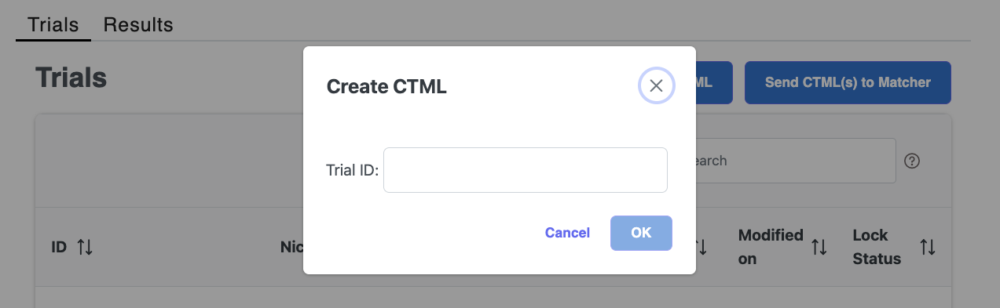<figcaption>
CTML creation popup box requiring the user to enter a trial ID.
</figcaption></figure>

## Navigation Panel

Once a user submits the NCT ID number, a new webpage will be opened. This is the CTML editor, where the abstraction of the clinical trial's information is input. On the left-hand side of the webpage is an in-page navigation panel that displays all the sections of a CTML. A user can click onto a section name, and the webpage will automatically take the user to that section of the form.&#x20;

For descriptions of each CTML section and their fields, please refer to the [CTML Glossary page](../ctml-glossary.md).

## Matching Criteria Modal

The matching criteria modal is within a CTML's arm and within the Treatment List section.&#x20;

In this section of an arm, there is a window that previews all the entered trial criteria for a specific arm of the clinical trial. The view format is in either YAML or JSON; by default, the view is set to the YAML format as it is more user friendly to view. To change to the JSON format, simply click on the header labelled ‘JSON’. &#x20;

## Entering the matching modal

To begin entering the matching criteria, at the bottom of the <mark style="color:blue;">**`MATCHING CRITERIA`**</mark> section, click onto the **`Edit matching criteria`** .&#x20;

<figure>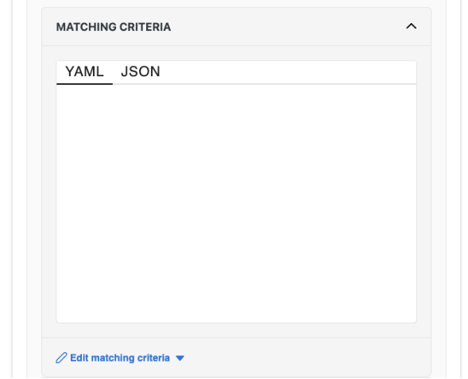<figcaption>
An empty matching criteria modal of the Matching Criteria section of an arm.
</figcaption></figure>

A modal will appear on the screen. The name that was entered in the **`Arm Name`** field will appear on the top left corner along with the phrase ‘matching criteria’. This serves as a reminder to the user about which arm they are working on.

<figure>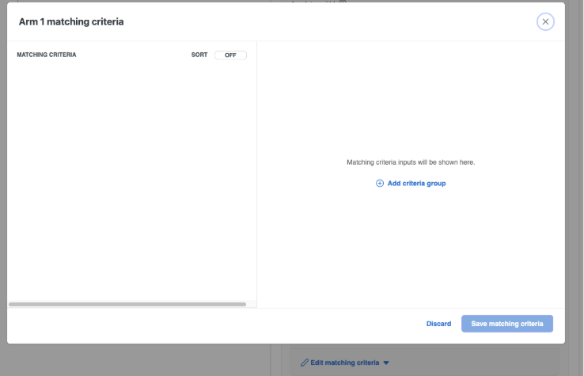<figcaption>
An empty opened editing matching criteria modal with name of the arm name entered displayed on top left corner.
</figcaption></figure>

## To begin entering criteria and options

Click on the <mark style="background-color:blue;">**+ Add criteria group**</mark> in blue on the right panel of the modal. The matching logic is a series of ‘<mark style="background-color:$info;">AND</mark>’ and ‘<mark style="background-color:$info;">OR</mark>’. By default, an ‘And’ will be selected for the user.

<figure>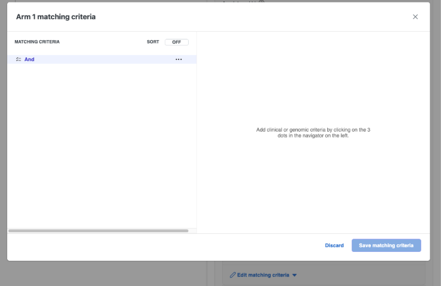<figcaption>
+Add criteria group was clicked which by default added an AND operator on the left panel, highlighted in purple
</figcaption></figure>

### **Switch group operator**

To change the operator to ‘OR’:

1. On the left panel, click on the three dots on the right of the purple highlighted ‘And’ for more options
2. Once the user clicks onto the three dots, click the <mark style="background-color:blue;">**Switch group operator**</mark> option – this will change the ‘And’ to the ‘Or’ operator.

<figure>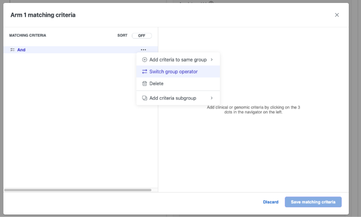<figcaption>
Matching criteria options menu displayed with 'Switch group operator' option selected
</figcaption></figure>

#### Other options

To add inner operators within the main branch, go to <mark style="background-color:blue;">**Add criteria subgroup**</mark>. Within this option, the user can select the ‘And’ operator or the ‘Or’ operator.&#x20;

To delete a whole group or subgroup criteria, click on the <mark style="background-color:blue;">**Delete**</mark> option. &#x20;

To add clinical, genomic or prior treatment criteria –click on the three dots in the navigator and select the <mark style="background-color:blue;">**+Add criteria to the same group**</mark> option.&#x20;

<figure>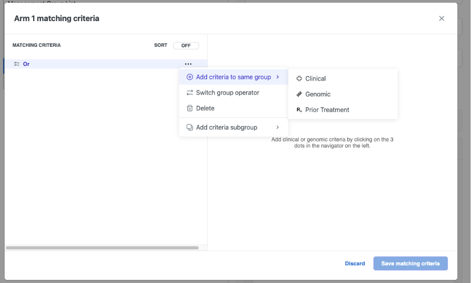<figcaption>
Matching criteria options menu displaying all the available types of criteria: Clinical, Genomic, Prior Treatment
</figcaption></figure>

### Within Criteria Panel Features

The following features are available for each type of criteria.&#x20;

When a criterion is selected (Clinical, Genomic, or Prior Treatment), the user can change the operator from within the criterion on the top right panel under the header **`Operator`**.

<figure>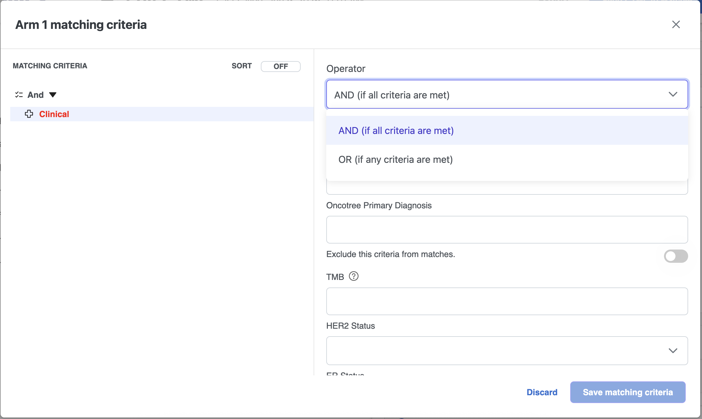<figcaption>
Changing the operator within a criterion through the operator field dropdown menu on right panel
</figcaption></figure>

### Empty criteria are in red

When a new criteria option is added, without any of the fields filled in on the right panel, the criterion option is highlighted in red font on the left panel. This is to warn the user that none of the fields are filled in. Once any field is filled in, the red font will disappear and become black font.&#x20;

### Delete criteria

The user can also delete a criterion from within as well through the red <mark style="background-color:blue;">**Delete**</mark> button with a garbage can icon on the top right panel.

<figure>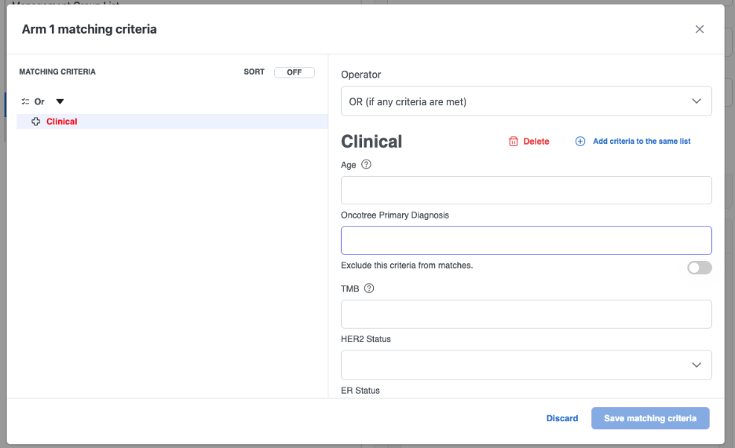<figcaption>
An empty clinical criteria is in red when no fields are filled and red delete button on right panel
</figcaption></figure>

### Adding the same criteria to the same list

The user can add the same type of criterion from within through the <mark style="background-color:blue;">**+Add criteria to the same list**</mark> button, on the top right panel (next to the delete button). For example, if the user is currently within a clinical criterion and would like another clinical criterion, the user can click onto this <mark style="background-color:blue;">**+Add criteria to the same list**</mark> button and another clinical criterion will be added. This additional criterion will be shown on the left panel in red, indicating that it is new and not filled in yet.

### Sorting criteria

On the top left panel, there is a <mark style="background-color:blue;">**SORT**</mark> field and an **`OFF`** toggle button.

By default, the matching criteria is displayed in the order of how the user enters each criteria, therefore by default the sort function is in the off mode.

<figure>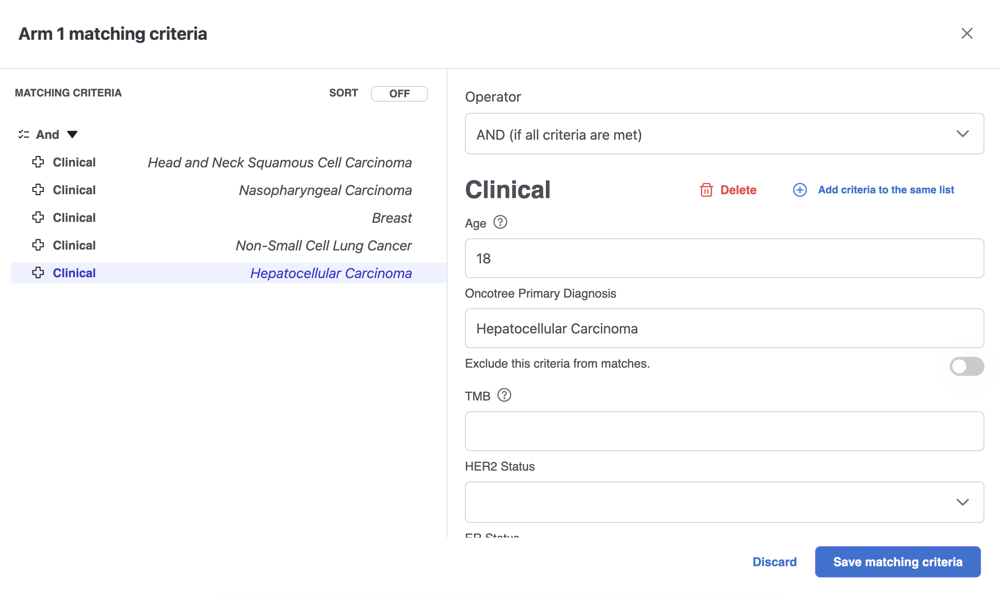<figcaption>
Example of the clinical matching criteria with sort function turned off. The criteria flows in the order of how the user enters the criteria
</figcaption></figure>

When the sort function is toggled to **`ON`**, the matching criteria will be sorted alphabetically.  &#x20;

<figure>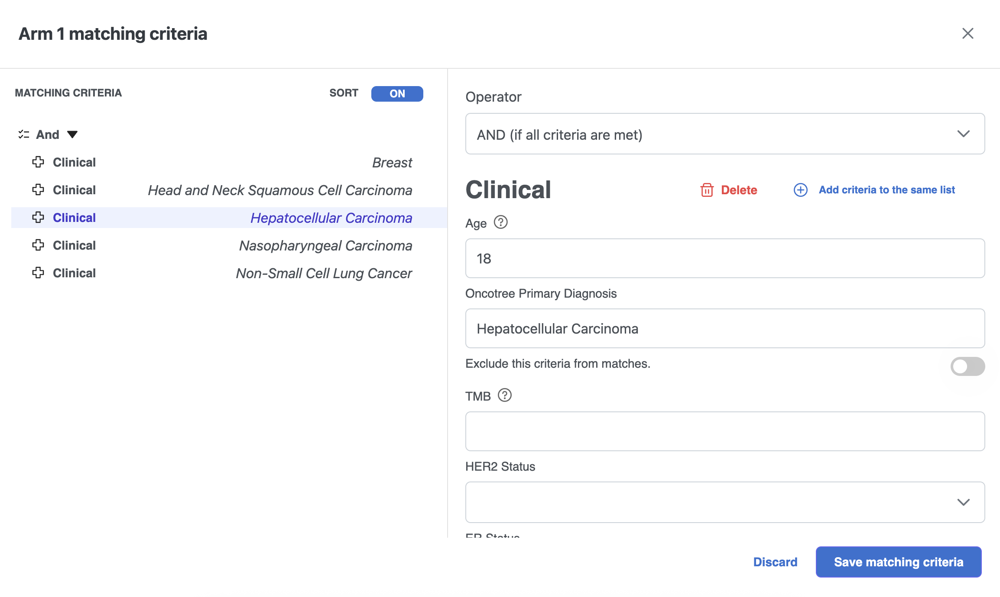<figcaption>
The sort function turned on with the same clinical criteria as the above example. The cancer types are now sorted in alphabetical order.
</figcaption></figure>


Once the sort function is switch to on and the criteria is sorted, clicking the toggle back to off will not un-sort the criteria back to how the user originally set the order of the criteria&#x20;


## Clinical Criteria

The following are the fields for the clinical criteria:&#x20;

* **Age**: Age required by criteria. Field expects integers. Typically, the value “>=18” is entered&#x20;
* **Oncotree Primary Diagnosis**: The cancer type name from [https://oncotree.mskcc.org/](https://oncotree.mskcc.org/) . The expected value for this field is the full cancer type name under the field “Name” from the oncotree website
  * For example, the cancer type _Head and Neck Squamous Cell Carcinoma_ (circled in blue below) is the expected value in this field
  * **Exclude this criteria from matches**: To exclude a specific cancer type, turn on the toggle to exclude it. The default is set to off
  * There are special key words that can be used in this field:
    * To represent any solid tumours: `_SOLID_`&#x20;
    * To represent any liquid tumours: `_LIQUID_`

<figure>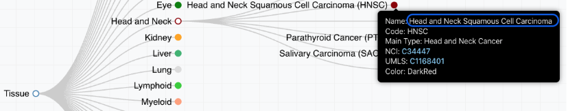<figcaption>
Oncotree Primary Diagnosis field is expecting a cancer type name from Oncotree
</figcaption></figure>

* **TMB**: Tumor mutational burden (TMB) is a biomarker defined as the total number of genetic mutations found within the DNA of a cancer cell. Measured in mutations per megabase (mut/Mb) of genomic sequence. The field expects an integer or decimal value.
* **HER2 Status**: Human Epidermal growth factor Receptor 2 (HER2) protein in a tumor. Values are either Negative or Positive&#x20;
* **ER Status**: Estrogen receptor (ER) status. Values are either Negative or Positive&#x20;
* **PR Status**: Progesterone receptor (PR) protein. Values are either Negative or Positive&#x20;

<figure>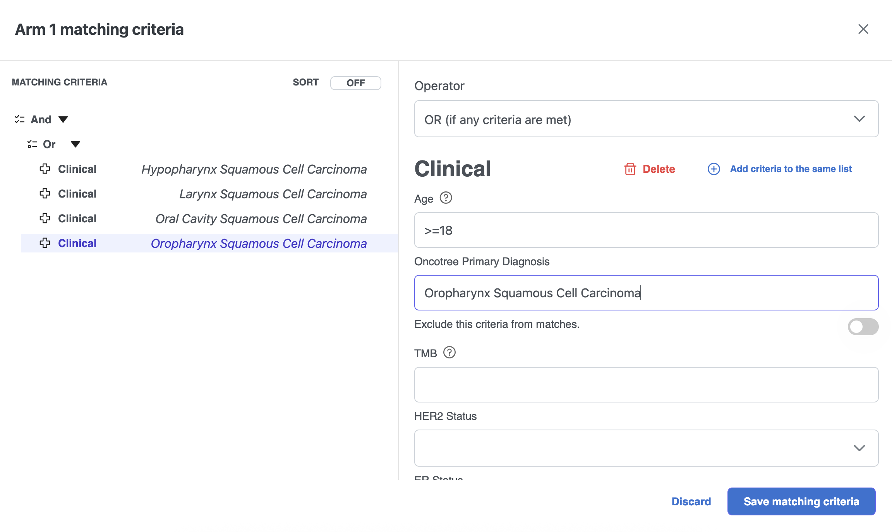<figcaption>
Example of clinical criteria fields filled out
</figcaption></figure>


If a user still has an empty criterion added on the left panel that does not have any fields filled out, it will be indicated in red. In this scenario, the **`Save matching criteria`** button will be greyed out; button is temporarily disabled. This button will be disabled until the user fills out at least one field within the criterion or deletes the empty criterion.


<figure>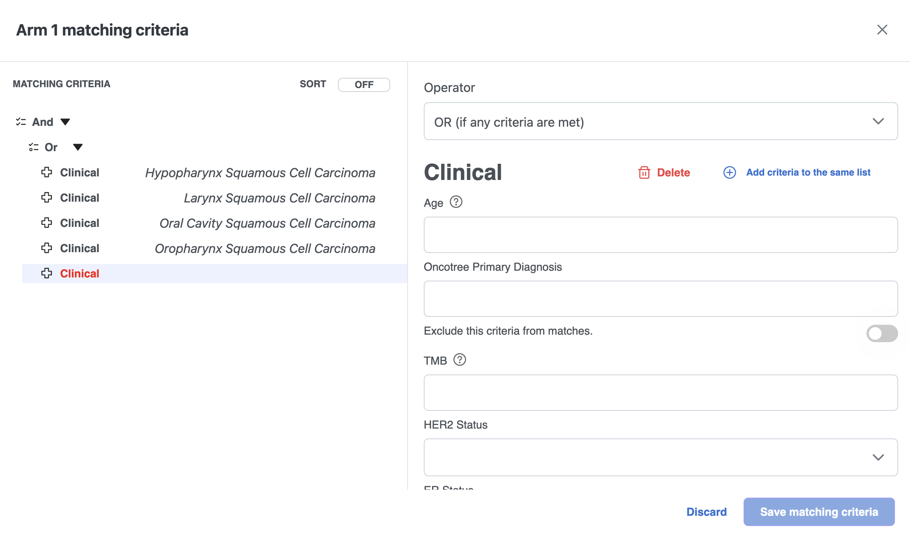<figcaption>
Example of when the 'Save matching criteria' button is temporarily disabled
</figcaption></figure>

#### Discard and X exit button

The discard button is to exit out of the matching criteria and discarding any input. Once a user clicks on the **`Discard`** button, a popup will appear, asking the user to confirm if they want to discard the match criteria entered.&#x20;

Clicking on the **`X`** button on the top right corner of the dialog will also prompt the same popup.&#x20;

<figure>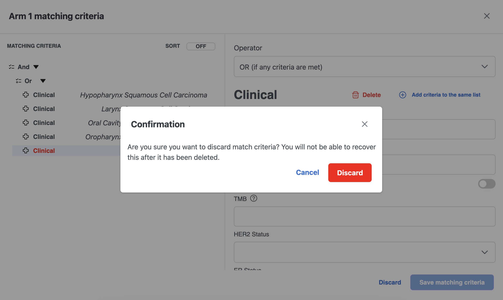<figcaption>
Example of discard confirmation popup when the discard or X exit button is clicked
</figcaption></figure>

#### Matching criteria modal window

After some matching criteria has been entered and saved, the criteria window now allows the user to preview the entered criteria.

**YAML view:**

<figure>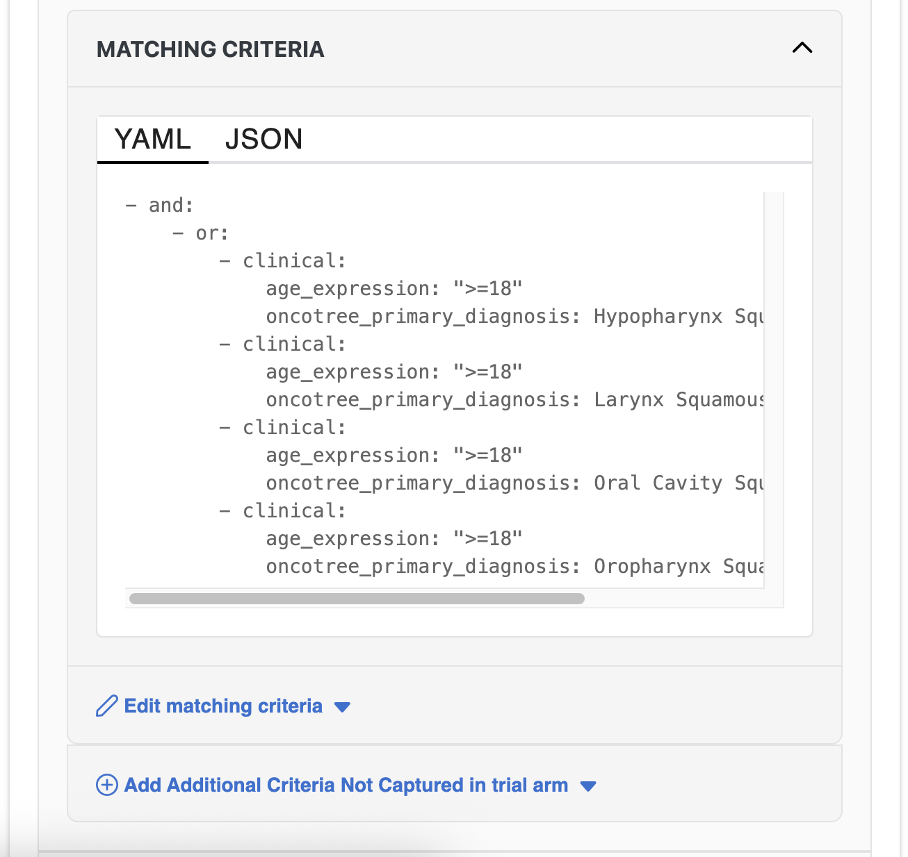<figcaption></figcaption></figure>

**JSON view:**

<figure>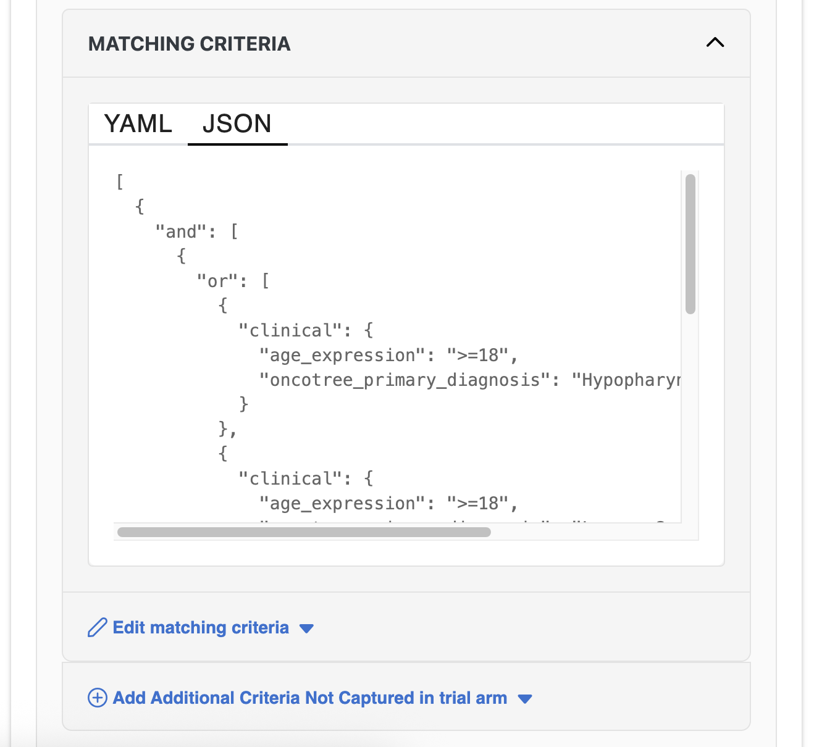<figcaption></figcaption></figure>

## Genomic Criteria

The genomic criteria is organized through the type of alteration through the **`Variant Category`** dropdown menu. This helps the user narrow down the different types of genomic data. Only the fields pertaining to the chosen category will be displayed.&#x20;

<figure>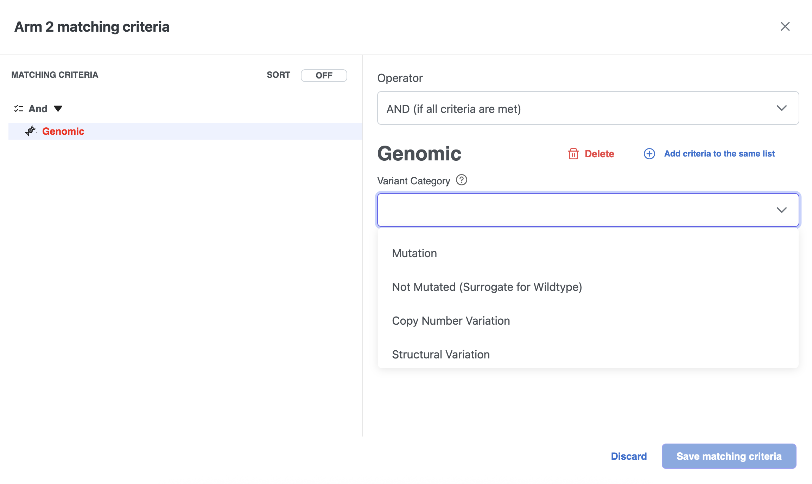<figcaption>
Genomic criterion selected and variant category dropdown menu displayed
</figcaption></figure>

**`Variant Category`** options and their fields:&#x20;

### Mutation

*   **Hugo Symbol**: The gene symbol. This is an auto complete field with real-time suggestions as a user types into this input field. The user is to select one of the gene symbols in the dropdown menu. The field is populated by an official gene symbol from [https://www.genenames.org/](https://www.genenames.org/)

    * **Exclude this criteria from matches**: To exclude a specific gene, turn on the toggle to exclude it. The default is set to off. &#x20;

    <figure>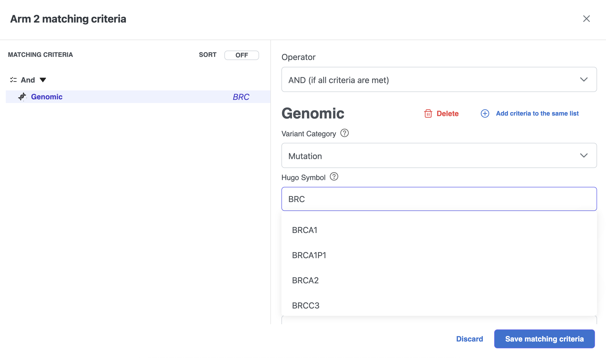<figcaption>
Example of the mutation category selected. Showing when a user starts to type in the Hugo Symbol field, the auto-completion of the gene symbols 
</figcaption></figure>
*   **Protein Change**: Specific protein change for the mutation. Any valid protein change. Format must start with a letter p and dot i.e., ‘p.XXXX’. If the correct format is not entered, the field will be highlighted in red and the panel on the left listing the criteria for this specific criterion will also be highlighted in red. When hovering over the information tool tip symbol, there are examples of some protein changes.  

    <figure>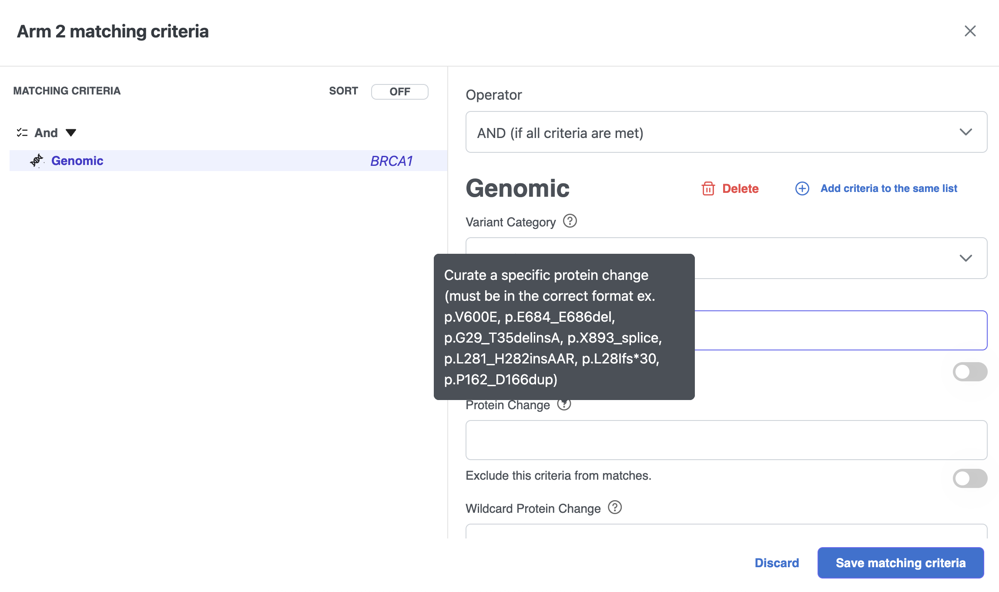<figcaption>
Example of when a user hovers over the information tool tip, the list of protein change examples
</figcaption></figure>


If the protein change field is used, until a correct protein change format is entered, the **`Save matching criteria`** button will be temporarily disabled.


* **Wildcard Protein Change**: Curate variations of a protein change (must be in the correct format ex. P.T70). This allows matching of any mutation at this site.&#x20;
* **True Transcript Exon**: A mutation on a specific exon location. Any valid exon number; an integer is expected&#x20;
* **Variant Classification**: The functional impact of a genetic variant on a specific transcript (e.g., whether it alters a protein or changes a non-coding region). Values: Frame Shift Del, Frame Shift Ins, In Frame Del, In Frame Ins, Missense Mutation, Nonsense Mutation, Splice Site, Translation Start Site, Nonstop Mutation, RNA, Targeted Region, De Novo Start In Frame, De Novo Start Out of Frame, Splice Region or Unknown&#x20;
* **Molecular Function**: The biological effect of a mutation on the protein function. This field is an annotated field when running oncoKB when generating the MAF file. Specifically looking at the MUTATION\_EFFECT column in the MAF file. Values: Activating or Inactivating&#x20;

<figure>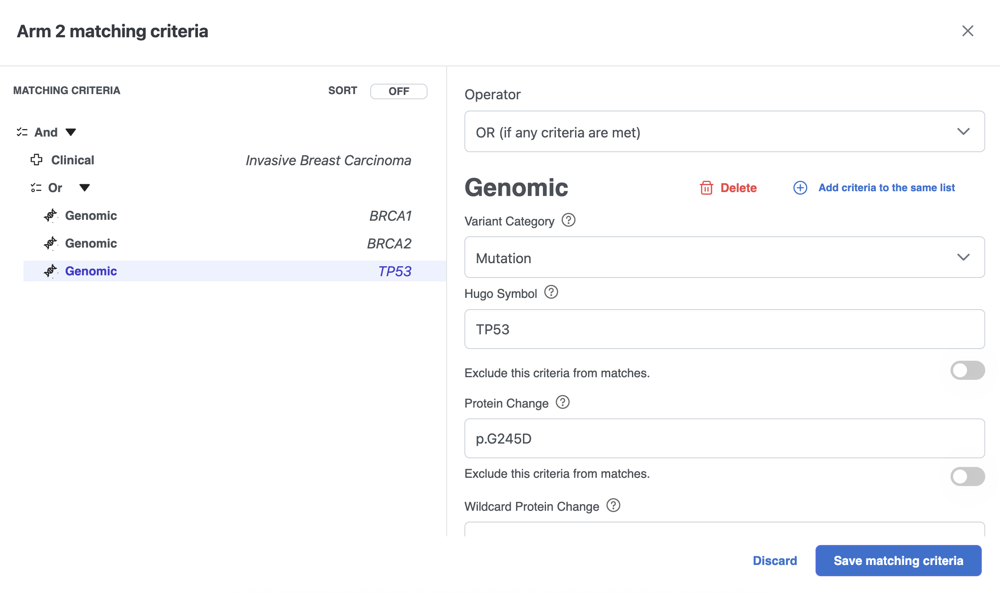<figcaption>
Example of the genomic criteria, mutation category fields filled out
</figcaption></figure>

### Not Mutated (Surrogate for Wildtype)

* **Hugo Symbol**: The gene symbol. This field is auto complete with real-time suggestions as a user types into this input field. The user is to select one of the gene symbols in the dropdown menu. In this variant category, this is the wildtype gene. The field is populated by an official gene symbol from [https://www.genenames.org/](https://www.genenames.org/)
  * **Exclude this criteria from matches**: To exclude a specific gene, turn on the toggle to exclude it. The default is set to off.

### Copy Number Variation

* **Hugo Symbol**: The gene symbol. This field is auto complete with real-time suggestions as a user types into this input field. The user is to select one of the gene symbols in the dropdown menu. The field is populated by an official gene symbol from [https://www.genenames.org/](https://www.genenames.org/)
  * **Exclude this criteria from matches**: To exclude a specific gene, turn on the toggle to exclude it. The default is set to off.&#x20;
* **CNV Call**: The type of copy number variation.  Values: Heterozygous deletion, Homozygous deletion, Gain, High level amplification&#x20;
  * **Exclude this criteria from matches**: To exclude a specific copy number variation type, turn on the toggle to exclude it. The default is set to off.&#x20;
* **Molecular Function**: Refers to tasks or activities characteristic of the gene. Values: Activating or Inactivating

<figure>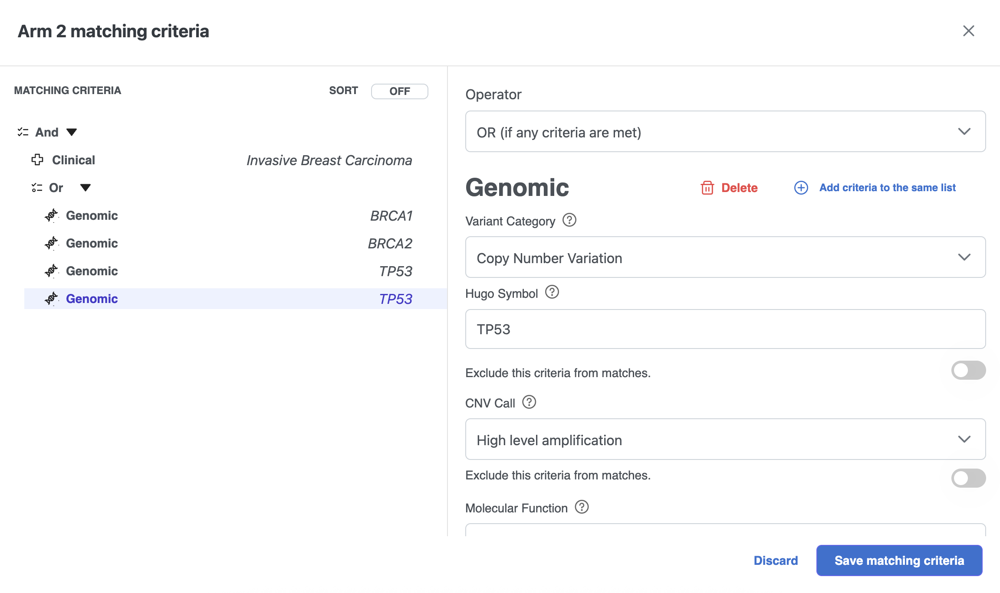<figcaption>
Example of genomic criteria with CNV category fields filled out
</figcaption></figure>

### Structural Variation

* **Hugo Symbol**: The gene symbol. This field is auto complete with real-time suggestions as a user type into this input field. The user is to select one of the gene symbols in the dropdown menu. The field is populated by an official gene symbol from [https://www.genenames.org/](https://www.genenames.org/)
  * **Exclude this criteria from matches**: To exclude a specific gene, turn on the toggle to exclude it. The default is set to off.&#x20;
* **Fusion Partner Hugo Symbol**: The partner gene in a fusion. The field is expecting an official gene symbol from [https://www.genenames.org/](https://www.genenames.org/) OR special key words are also allowed: `any_gene` (indicating that any gene can be a fusion partner) or `intergenic` (non-protein coding genes).
  * **Exclude this criteria from matches**: To exclude a specific gene, turn on the toggle to exclude it. The default is set to off.&#x20;
* **Molecular Function**: Refers to tasks or activities characteristic of the gene. Values: Activating or Inactivating

<figure>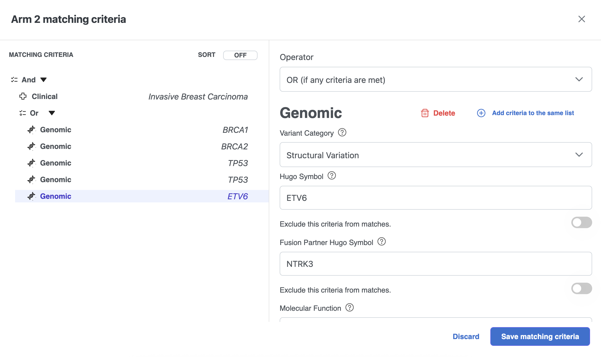<figcaption>
Example of genomic criteria with structural variation fields filled out
</figcaption></figure>

### Signature

* **MS Status**: Microsatellite Stability Status. Values: MSI-H, MSI-L, or MSS.&#x20;
* **MMR Status**: Mismatch Repair Status. Values: MMR-Proficient or MMR-Deficient&#x20;
* The following fields have the same values to select from: Yes, No, Cannot assess, or Insufficient variants.&#x20;
  * **POLE Status**: POLE signature status &#x20;
  * **UVA Status**: UVA signature status&#x20;
  * **Tobacco Status**: Tobacco signature status&#x20;
  * **APOBEC Status**: APOBEC signature status&#x20;
  * **Temozolomide Status**: Temozolomide signature status

<figure>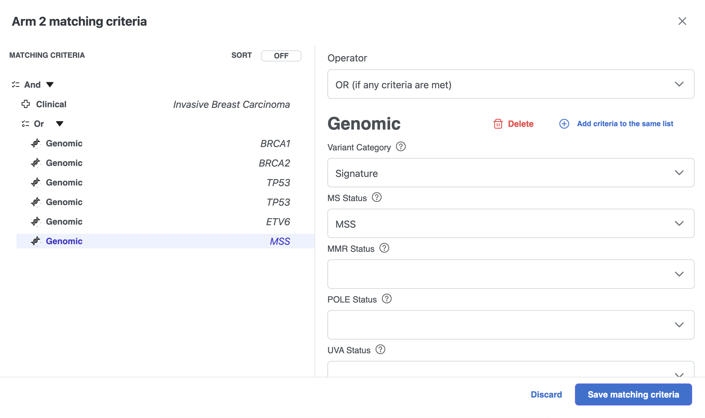<figcaption>
Example of genomic criteria with signature fields filled
</figcaption></figure>

## Prior Treatment&#x20;

In the prior treatment criteria selection, it categorizes into several different categories: Medical Therapy, Surgery, and Radiation Therapy. Once the user selects a category, the applicable fields will be displayed. &#x20;

### Medical Therapy

* **Medical Therapy Subtype**: The different types of medical therapies. Drop-down options: Immunotherapy, Targeted Therapy, Hormone Therapy, Chemotherapy.
*   **Agent Class**: (or drug class) refers to a group of medications or chemical substances that share similar properties. They are categorized based on their chemical structure, mechanism of action (how they work in the body), or therapeutic effects (the conditions they treat). This is an auto-complete field where the values are populated from a subset of NCI Thesaurus vocabulary, [https://evsexplore.semantics.cancer.gov/evsexplore/welcome](https://evsexplore.semantics.cancer.gov/evsexplore/welcome)

    * **Exclude this criteria from matches**: To exclude this drug class, turn on the toggle to exclude it. The default is set to off.

    <figure>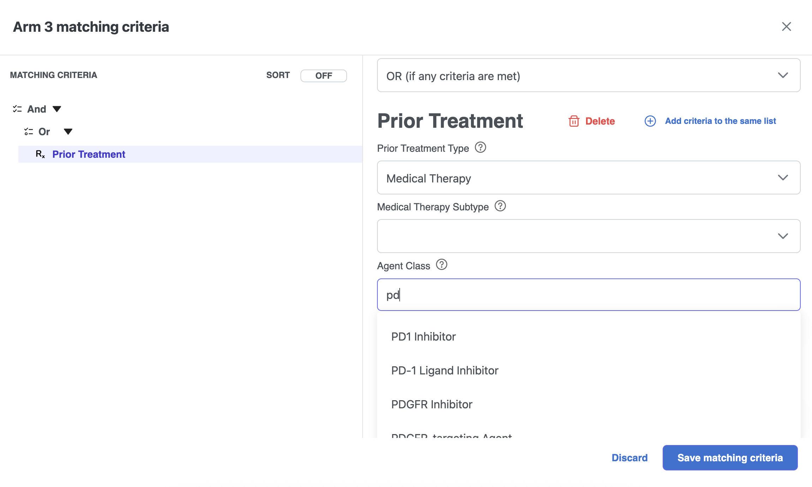<figcaption>
Example of prior treatment criteria with the agent class field's auto-complete displayed 
</figcaption></figure>
* **Agent**: The drug name. This is an auto-complete field where the values are NCI Thesaurus vocabulary terms populated.
  * **Exclude this criteria from matches**: To exclude this drug, turn on the toggle to exclude it. The default is set to off.


TIP: Try typing the full agent name or class—short-form names aren't always recognized in our system vocabulary.


### Surgery

* **Surgery Type**: The type of surgery the criteria indicated. Free text field.

### Radiation Therapy

* **Radiation Type**: The type of radiation treatment. Free text field.
* **Radiation Site**: The body site the radiation treatment was performed on. Free text field.

<figure>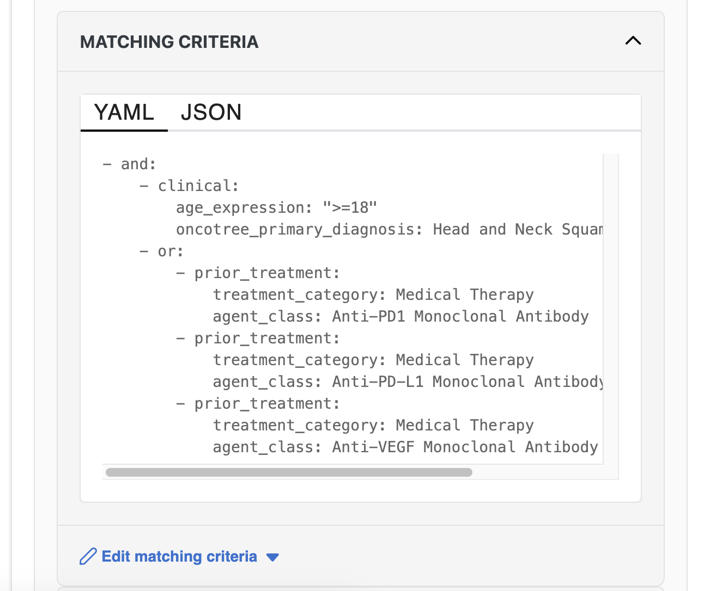<figcaption>
Example of prior treatment criteria entered and viewing on the matching criteria window
</figcaption></figure>

## Add Additional Criteria Not Captured in trial arm

Under each matching criteria modal, there is another sub-section within an arm section called the <mark style="background-color:blue;">**+Add Additional Criteria Not Captured in trial arm**</mark> that is located just after the <mark style="background-color:blue;">**Edit matching criteria**</mark> button. This is for any criteria that the user was unable to include in the matching criteria modal for a specific arm. This section contains empty text fields for the user to use. The user can add as many additional criteria they would like by clicking on the <mark style="background-color:blue;">**+Add Additional Criteria Not Captured in trial arm.**</mark>

<figure>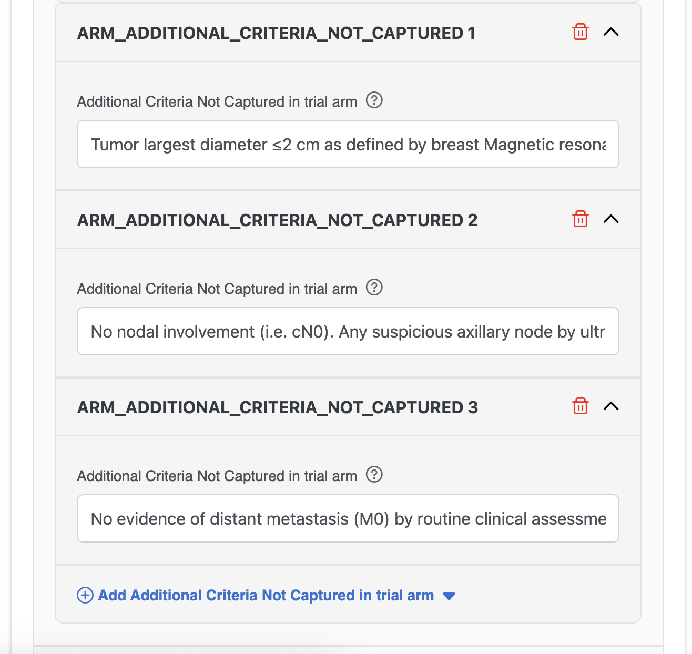<figcaption>
Example of additional arm criteria not captured fields filled
</figcaption></figure>

## ADDITIONAL CRITERIA NOT CAPTURED

These fields are for any additional criteria that were not captured in the CTIMS fields. The user can add anything pertaining to the clinical trial.  &#x20;

While the <mark style="background-color:blue;">**+Add Additional Criteria Not Captured in trial arm**</mark> section applies specifically to an individual arm, this section applies globally across the entire trial. The distinction here is scope: criteria added within a specific arm apply only to that arm, whereas this section captures criteria that apply more broadly.

<figure>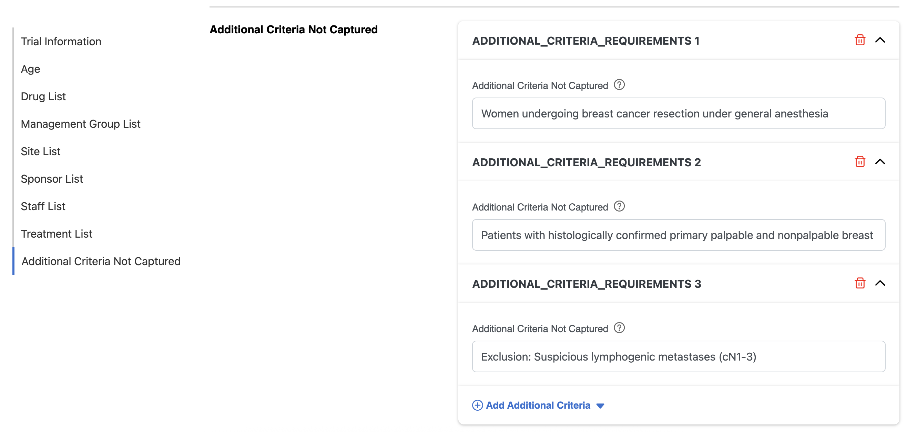<figcaption>
Example of additional criteria not captured section fields filled. This is the last section of the navigation panel indicated by the blue indicator on the left.
</figcaption></figure>
