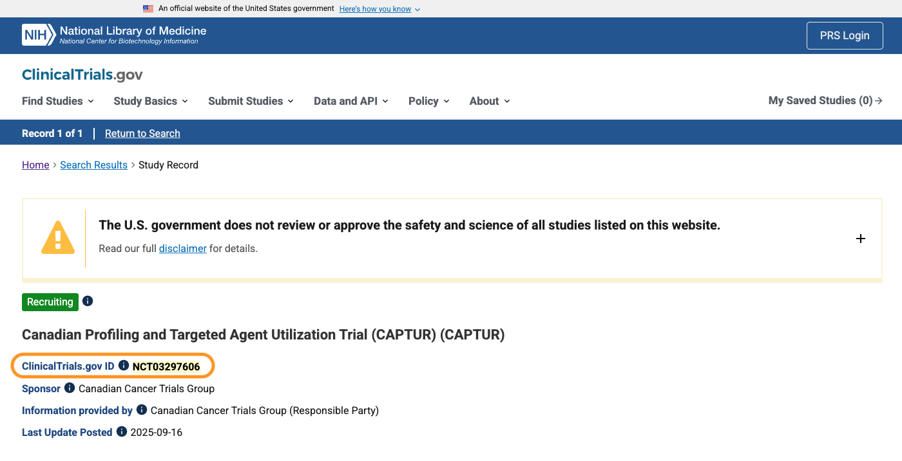
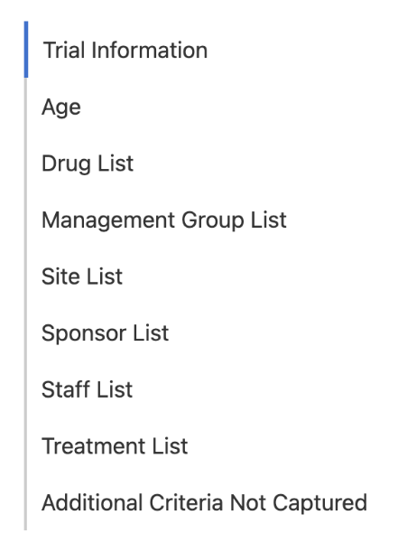
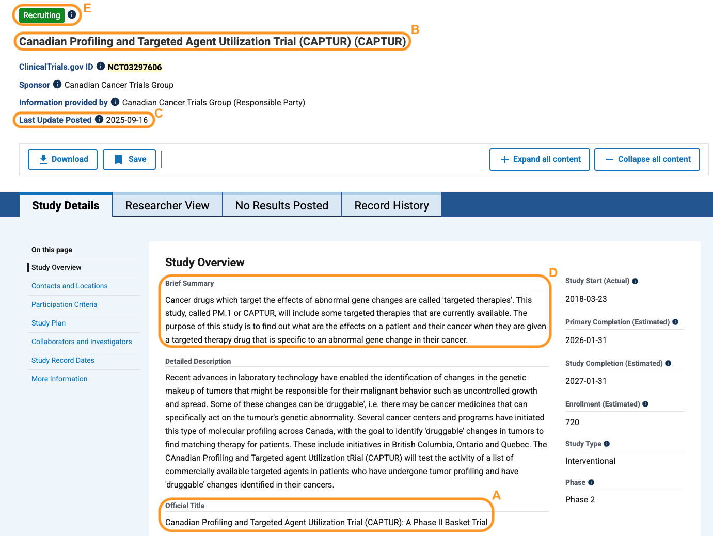

# CTML Glossary

## Trial ID

A _Trial ID_ is required for creating a CTML.

* A trial ID is an identifier for the clinical trial. For CTIMS, we are referring to the NCT ID for the clinical trial. The NCT ID is an identifier used on the [www.clinicaltrials.gov](https://www.clinicaltrials.gov/) website (field name: `ClinicalTrials.gov ID`), for uniquely identifying a clinical trial.
* The NCT identifier structure begins with “NCT” followed by 8 integers.&#x20;
  * Sometimes this NCT ID is not available in the clinical trial document. If this is the case, the best alternative is to go to [www.clinicaltrials.gov](https://www.clinicaltrials.gov/) and search by the official clinical trial title (long title). Compare the information if it matches. Also compare (if available on [www.clinicaltrials.gov](https://www.clinicaltrials.gov/) - the protocol number), listed drugs and sponsor.&#x20;
  *   The figure below is an example of where the NCT ID can be found on the clinicaltrials.gov website. The `ClinicalTrials.gov ID` field and the NCT ID value is circled in orange and the NCT ID is highlighted in yellow.

      <figure><figcaption>
Figure 1: An example of an NCT ID on the clinicaltrials.gov website, the field and value are highlighted
</figcaption></figure>

## Navigation Panel

The following is a breakdown each of the sections and their fields:

<figure><figcaption>
Figure 2: CTIMS Editor navigation panel for all the CTML sections
</figcaption></figure>

### Trial Information

This section provides all the descriptive metadata about the clinical trial.

* **`Trial ID`**: It is referring to the NCT ID for the clinical trial. The NCT ID is an identifier used on the [www.clinicaltrials.gov](https://www.clinicaltrials.gov/) website (field name: `ClinicalTrials.gov ID`), for uniquely identifying a clinical trial. The identifier structure begins with “NCT” followed by 8 integers. Sometimes this NCT ID is not available in the clinical trial document. If this is the case, the best alternative is to go to [www.clinicaltrials.gov](https://www.clinicaltrials.gov/) and search by the official clinical trial title (long title). Compare the information if it matches. Also compare (if available on [www.clinicaltrials.gov](https://www.clinicaltrials.gov/) - the protocol number), listed drugs and sponsor.
* **`Nickname`**: If there is a unique acronym used for the clinical trial, this would be the value entered for this field. If not, the drug used or protocol identifier
* **`Principal investigator`**: The main principal investigator (clinical trial lead) for the clinical trial site the curator is abstracting the CTML for
* **`CTML Status`**: There are three options:
  * <mark style="color:$info;">**`Draft`**</mark>
    * This status is when clinical trial data abstraction is ongoing
    * When in this status mode, trial matching cannot be done, as the abstraction is still in progress
  * <mark style="color:$info;">**In Review**</mark>
    * When the abstraction is done and the CTML can be sent to the Matcher for trial matching
    * The abstractor can download and review the results and if the results are not what the abstractor intended the CTML criteria to be configured, the CTML can be edited and re-send to the Matcher; it is an iterative process
  * <mark style="color:$info;">**`Complete`**</mark>
    * When the abstractor is satisfied with the CTML and results, the status can be set to complete
* **`Long Title`**: The official title of the clinical trial (this is always listed in the clinical trial document and on [www.clinicaltrials.gov](https://www.clinicaltrials.gov/), it is found under section header “Study Overview” and field name `Official Title` , see Figure 3A.
* **`Short Title`**: The short title of the clinical trial (sometimes this is not listed in the clinical trial document; then use the short title on [www.clinicaltrials.gov](https://www.clinicaltrials.gov/). On the website, It is found on the top section of the clinical trial’s study page, written in bold; underneath the recruitment status, see Figure 3B .
* **`Phase`**: The phase of the clinical trial. There are four options: I, II, III, IV. This is a multi-select field, where multiple options can be selected.
* **`Protocol Number`**: The unique identifier used for the clinical trial in the clinical trial document. As different pharmaceutical sponsor companies have their own identifier structure for their trials, the value for this is heterogenous.
* **`Protocol Version Number`**: The clinical trial document version number. As there are several versions and amendments to a clinical trial throughout a trial’s lifetime; the specific version that the trial was abstracted from is important to be aware of and kept track of.
* **`Protocol Version Date`**: The date of the protocol version. This can often be found in the first few pages of the document or sometimes the last page of the protocol. If curating from clinicaltrials.gov, the date used is `Last Update Posted`, see Figure 3C.
* **`REB Number`**: The Research Ethics Board Number of the protocol.
* **`NCT Purpose`**: The purpose of the clinical trial, see Figure 3D.
* **`Status`**: This is the recruitment status of the clinical trial. This is not found on the protocol document; it is found on [www.clinicaltrials.gov](https://www.clinicaltrials.gov/) at the top section of the study’s page, on the top left corner, see Figure 3E.

The following figure is an example of where you can alternatively find the information if it is not provided  in the protocol at your institution.

<figure><figcaption>
Figure 3: Applying clinicaltrials.gov fields to CTML. A) Official Title = Long Title B) Short Title  C) Last Update Posted = Protocol Version Date (if applicable) D) Brief Summary = NCT Purpose E) Status
</figcaption></figure>

### Age

The age section denotes the age group the clinical trial is aimed for.

* **`Age Group`**: The age group the clinical trial is targeting.
  * Options in this field: Children, Adult, Older Adult
  * It is a multi-select field, where the user can select more than one option 

### Drug List

The drug list section details all the drugs that will be used in the clinical trial.

* **`Drug Name`**: The name of a drug.
  * Please only list one drug per field.&#x20;
  * To add another drug name, click on the **`Add Drug`** button, a new field will be presented. 

### Management Group List

This section lists all the hospital/cancer centre sites that manage the clinical trial.

* **`Management Group Name`**: The site location conducting the clinical trial
  * Dropdown menu of sites
  * If the site you are looking for is not present, please contact CTIMS
* **`This is a primary management group`**: Yes or No
* **`Add Management Group`**: An option to add another site and set of information 

### Site List

The site list is a more detailed listing of the hospital/cancer centre sites.

* **`Site Name`**: The site location conducting the clinical trial
* **`Site Status`**: The status of the clinical trial at the selected site location
* **`This site is a coordinating center`**: Yes or No
* **`This site uses cancer center IRB`**: Yes or No
* **`Add Site`**: Add another site and their and set of information 

### Sponsor List

This section lists the sponsor of the clinical trial.

* **`Sponsor Name`**: The sponsor of the clinical trial. Usually, it is a pharmaceutical company
* **`This sponsor is a principal sponsor`**: Yes or No

### Staff List

The details of the principal investigator at the site the CTML is curated for.

* **`First Name`**: The first name of the clinical lead of the trial
* **`Last Name`**: The last name of the clinical lead of the trial
* **`Email`**: The email of the clinical lead
* **`Institution Name`**: The site the clinical lead of the trial is part of
* **`Staff Role`**: Principal Investigator
* **`Add Protocol Staff`**: Add another clinical lead/principal investigator

### Treatment List

This section is where the clinical trial criteria are listed. Per Step section, there are arm(s), within each arm, there are dose(s), a matching criteria modal, and additional criteria fields that can be added.

#### Step:

For clinical trials that have more than one step. If steps are used, each step contains its own individual arm(s) and dose(s) and match criteria.

***

#### Arm:

An arm of a clinical trial outlines the use of specific drug(s) and a set of matching criteria.

* **`Arm Code`**: The name of the arm
* **`Arm Description`**: A description of what the arm is about
* **`Arm Type`**: The type of arm i.e., Investigational or Experimental
* **`Arm Internal Id`**: Expecting an integer (incremental)
* **`Arm is suspended`**: Yes or No

***

#### Dose:

Dose refers to the specific drug(s) that an arm will use. Each dose section is for one drug. If there is more than one drug, add another dose level.

* **`Level Code`**: The name of the drug
* **`Level Description`**: A description of the drug/dose
* **`Level Internal Id`**: Expecting an integer (incremental)
* **`This level is suspended`**: Yes or No
* **`Add Dose Level`**: Add another drug and their details

***

#### Matching Criteria

For details on how to use the matching criteria modal and full descriptions on the matching criteria fields, please refer to  [CTML Abstraction/Creation page](ctml-abstraction-creation/).

#### Add Additional Criteria Not Captured In trial arm

This section provides empty text fields for the user to enter any information that was unable to be captured by the matching modal fields for an arm. 

### Additional Criteria Not Captured

These fields are for any additional criteria that were not captured in the CTIMS fields. The user can add anything pertaining to the clinical trial. &#x20;

The difference between this section and the <mark style="color:blue;">**`Add Additional Criteria Not Captured In trial arm`**</mark> section within the arm is that those additional criteria pertain specifically for that applicable arm. This section is for the whole clinical trial/all the arms in the trial.
