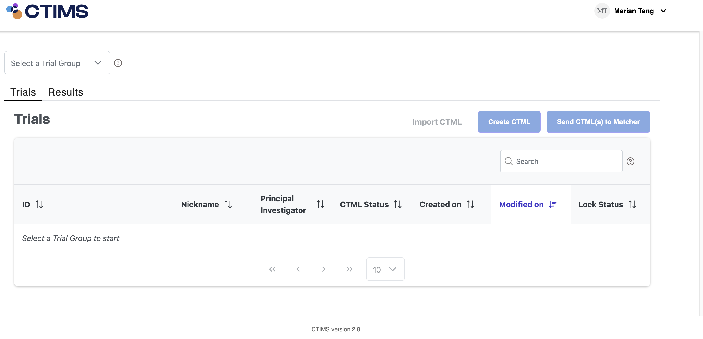
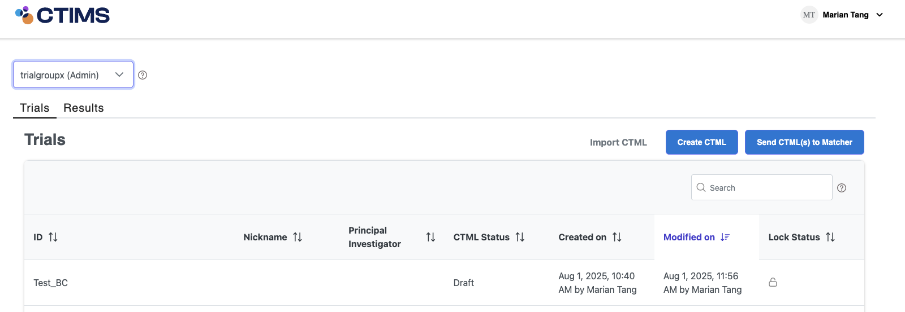

# User Homepage

## Trial Group Selection

Once a user successfully logs into the CTIMS application, users will be presented with an empty trials dashboard as no trial group is selected, as displayed in the figure below.  Select a trial group to view the Trials dashboard which displays all CTMLs created within that trial group.&#x20;

Users must select a trial group to create a CTML. The <mark style="color:orange;">trial group</mark> dropdown menu is located on the top left corner of the webpage.

<figure><figcaption>
CTIMS user homepage after login. The user will need to select a <mark style="color:$primary;">trial group</mark> from the dropdown menu, as the trials dashboard is empty, all the buttons are greyed out and disabled until a group is selected.
</figcaption></figure>

\
Once a user selects a trial group, the name of the trial group will be displayed within the dropdown menu. The user's role within that selected trial group will also be displayed in parentheses (as shown in the purple highlighted trial group menu in the figure below).&#x20;

The trials dashboard is populated with all the CTMLs created in this trial group. The `Create CTML` and `Send CTML(s) to Matcher` buttons are available to use on the right side (no longer greyed out).

<figure><figcaption>
A trial group is selected from the dropdown menu. The trials dashboard is now populated with all CTML trials available created by members of the group.
</figcaption></figure>

## Trials Dashboard

The trial table stores and displays all CTMLs created by members in that trial group and displays high-level details for each CTML.&#x20;

The dashboard consists of the following information:

* <mark style="background-color:blue;">**ID**</mark>: The NCT identifier for the clinical trial
* <mark style="background-color:blue;">**Nickname**</mark>: A nickname for the clinical trial
* Principal Investigator: The main principal investigator (clinical trial lead) for the clinical trial site, the curator is abstracting this CTML for
* <mark style="background-color:blue;">**CTML Status**</mark>: The current status of the CTML
* <mark style="background-color:blue;">**Created on**</mark>: What date the CTML was created on
* <mark style="background-color:blue;">**Modified on**</mark>: The last modified date for the CTML
* <mark style="background-color:blue;">**Lock Status**</mark>: A lock icon or unlocked icon
  * A locked icon indicates that someone else is editing the CTML under the same trial group. The second user will only have read-only access and cannot edit the CTML at the same time
  * An unlocked icon indicates that no one else is editing the CTML and the curator can edit the CTML

***

#### Import CTML

Users can import CTML files into a selected trial group. File formats in yaml and JSON are acceptable.

***

#### Search

Within the dashboard, on the top right corner, there is a search field for the user to search through all the CTML under the selected trial group.

***

#### Sortable Headers

Each column headers are sortable when clicked on the header name, as indicated by the up and down arrow.

***

#### Pagination

At the bottom of the dashboard, there are single and double arrows, page numbers, and a dropdown menu for pagination:&#x20;

* The user can use the dropdown menu to select how many trials to view at a time. By default, one page displays 10 trials
* The single arrow is to go to the next page of trials
* The double arrows navigate to the start/end of the trials in a specific trial group
* The user can also click on the page number to navigate to that page of trials

## Explore/View a CTML

To explore a clinical trial’s CTML, hover over a trial ID on the dashboard, the trial will be highlighted in grey. 

* Three dots will appear with options, once the user clicks onto the dots, the options available are:
  * _<mark style="color:blue;">**Edit**</mark>_: This will take the user **into** the CTML for the trial
  * _<mark style="color:blue;">**Delete**</mark>_: This will delete the CTML

### Edit CTML

Trial group administrators can click to edit all CTMLs. Trial group members can only edit CTMLs they create (CTMLs created by another account is read-only).

Step to Edit CTML: &#x20;

1. Hover over the CTML in the trial table&#x20;
2. Click the 3 dots to display a dropdown list&#x20;
3. Click the Edit option to display CTML details

### Delete CTML

Trial group administrators can click to delete all CTMLs. Trial group members can only delete CTMLs they create.&#x20;

Steps to Delete CTML:&#x20;

1. Hover over the CTML in the trial table&#x20;
2. Click the 3 dots to display a dropdown list&#x20;
3. Click the Delete option&#x20;
4. Click the Delete button in the confirmation window&#x20;

### Create CTML

Click the `Create CTML` button to build clinical trial eligibility using the CTIMS Editor.
